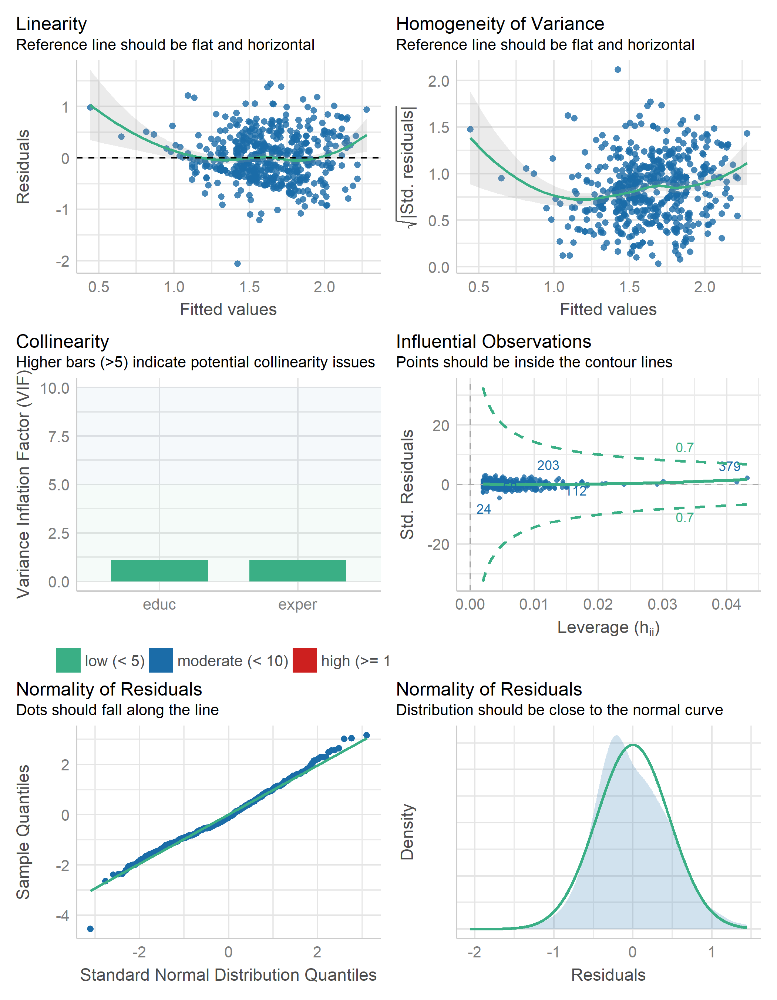

```{r, file = "./rmd/setup.R", include=FALSE}
```


```{css, echo=FALSE}
pre {
  white-space: pre-wrap;
  overflow-y: scroll !important;
  max-height: 45vh !important;
  overflow-x: auto;
  max-width: 100%;
}
```


### Introdução

Neste post mostraremos **como construir modelos de regressão linear de maneira aplicada**. Se você já se perguntou em como replicar no R aqueles modelos introdutórios, comuns em disciplinas de estatística e econometria, este post é pra você!

Dessa forma, **usaremos a econometria** - que é um conjunto de métodos estatísticos utilizados para estimar relações econômicas, testar teorias e avaliar políticas públicas ou de negócios - **para explorar um problema aplicado ao mercado de trabalho**. Nada melhor do que entender como utilizar algo com um exemplo prático, certo?

Portanto, assumimos que você já possui algum conhecimento teórico sobre modelos de regressão linear, pois daremos ênfase no aspecto prático de como implementar este tipo de modelo usando o R. Você pode conferir o **curso de [Introdução à Econometria](https://analisemacro.com.br/cursos/econometria/introducao-a-econometria/) (em R e Python)** para explorar mais a fundo os pormenores dos modelos, assim como tópicos mais avançados que fogem do escopo deste post. É uma ótima oportunidade se você acha o assunto "assustador", pois o curso traz exemplos intuitivos e práticos do dia a dia.

Ademais, nossa referência base sobre o assunto é o livro-texto do Wooldridge (2020), que é muito utilizado em disciplinas de econometria de cursos de graduação.


---
### Pacotes

Para reproduzir os códigos deste exercício, você precisará dos seguintes pacotes de R:

```{r}
library(wooldridge)  # CRAN v1.4-2
library(performance) # CRAN v0.8.0
library(broom)       # CRAN v0.7.12
library(see)         # CRAN v0.6.9
library(report)      # CRAN v0.5.1
library(parameters)  # CRAN v0.17.0
library(tibble)      # CRAN v3.1.6
library(ggplot2)     # CRAN v3.3.5
library(patchwork)   # CRAN v1.1.1
library(magrittr)    # CRAN v2.0.2

```


---
### O problema e os dados

Para começar a entender o assunto, e exemplificar a estimação de um modelo linear, vamos recorrer a um conjunto de dados clássico do Wooldridge, que traz informações de uma pesquisa populacional. Mais especificamente, iremos investigar um problema de economia do mercado de trabalho: suponha que você seja contratado para determinar o efeito de um programa de aperfeiçoamento profissional na produtividade de trabalhadores. Sem se aprofundar muito na teoria econômica e especializada da área, podemos dizer que fatores como escolaridade, experiência profissional e treinamentos podem afetar a produtividade do trabalhador e, portanto, seus salários. Com esse simples entendimento em mente, podemos então definir um modelo econômico como:

$$salario = f(escolaridade, experiencia, treinamento)$$
onde `salario` é o salário por hora, `escolaridade` são os anos de educação formal, `experiencia` são os anos de experiência no mercado de trabalho e `treinamento` é o tempo despendido em aperfeiçoamento profissional. Outros fatores podem afetar `salario`, mas este modelo simples capta a essência do problema em questão. 

Essa formulação básica que elaboramos carrega a hipótese de que esses fatores especificados estão, de alguma forma, relacionados com o `salario` dos trabalhadores. O que precisamos fazer agora é investigar esse "modelinho" de forma empírica.


---
### O problema e os dados

Dado que estes fatores e variáveis podem ser observados - e se não fossem teríamos que levar isso em consideração -, o próximo passo é transformarmos esta especificação de modelo econômico para um **modelo econométrico**, como:

$$\operatorname{salario} = \beta_{0} + \beta_{1}(\operatorname{escolaridade}) + \beta_{2}(\operatorname{experiencia}) + \beta_{3}(\operatorname{treinamento}) + \epsilon$$

onde as constantes $\beta_{0}$, $\beta_{1}$, ..., $\beta_{3}$ são parâmetros do modelo que descrevem as direções (sinal) e as magnitudes (tamanho) da relação entre `salario` e as demais variáveis utilizadas para explicar `salario` no modelo; e o termo de erro $\epsilon$ contém fatores como "habilidade inata", qualidade da educação, histórico familiar e outros que podem influenciar o salário de um trabalhador, ou seja, o erro é comumente chamado de "medida do nosso desconhecimento". Se estivermos especialmente interessados no efeito do programa de aperfeiçoamento profissional, então $\beta_{3}$ é o parâmetro de interesse.

Para uma análise empírica deste modelo precisamos de dados, portanto, após essa breve introdução vamos partir para a prática! No R, o conjunto de dados para usarmos nesse modelo vem do pacote `{wooldridge}` e pode ser carregado conforme abaixo:

```{r}
# Carregar dataset
data("wage1")
```


---
### Exploração dos dados

Os dados são do tipo *cross-section* e contém variáveis de 526 indivíduos referente ao ano de 1976. Deste conjunto de dados, usaremos apenas as variáveis `wage` (salário por hora), `educ` (anos de educação) e `exper` (anos de experiência). Para facilitar o entendimento, utilizaremos a transformação logarítmica na variável dependente (`wage`), de forma a obter uma interpretação percentual dos parâmetros do modelo.

```{r}
# Inspecionar dataset
tibble::as_tibble(wage1)
```


---
### Exploração dos dados

No R, com um simples comando também é possível obter uma tabela de estatísticas descritivas das variáveis:

```{r}
# Estatísticas descritivas
parameters::describe_distribution(wage1)
```


---
### Exploração dos dados

Com o pacote `ggplot2` podemos facilmente visualizar, em um gráfico de dispersão, a relação entre as variáveis do modelo:

.pull-left[

```{r g1, fig.show='hide'}
library(magrittr)

# Visualização dos dados
p1 <- wage1 %>%
  ggplot2::ggplot() +
  ggplot2::aes(y = wage, x = educ) +
  ggplot2::geom_point() +
  ggplot2::geom_smooth(method = "lm")

p2 <- wage1 %>%
  ggplot2::ggplot() +
  ggplot2::aes(y = wage, x = exper) +
  ggplot2::geom_point() +
  ggplot2::geom_smooth(method = "lm")

p1 + p2
```

]

.pull-right[

```{r ref.label="g1", echo=FALSE}
```

]


---
### Estimar o modelo

Conforme dito, iremos estimar o modelo econométrico acima mas com algumas modificações: sem o fator `treinamento` e com transformação logarítmica na variável `salario`. Com estes ajustes, comuns em exercícios empíricos, chegamos a uma especificação como esta:

$$\operatorname{log(salario)} = \beta_{0} + \beta_{1}(\operatorname{escolaridade}) + \beta_{2}(\operatorname{experiencia}) + \epsilon$$

Ou seja, queremos saber a relação entre a escolaridade e experiência profissional dos trabalhares sobre os seus salários (em log). Dessa forma, devemos agora estimar os coeficientes que medem esses efeitos. 

No R, estimamos este modelo de regressão com a função `lm()` especificando os termos por uma fórmula e o objeto com os dados:

```{r}
# Estimar modelo
fit_modelo <- lm(log(wage) ~ educ + exper, data = wage1)
```


---
### Resultados do modelo

Para obter os resultados do modelo estimado use a função `summary()`, que é uma função genérica para obter resultados de diversas famílias de modelos:

```{r}
# Obter resultados
summary(fit_modelo)
```


---
### Resultados do modelo

.pull-left[

A interpretação dos resultados deste modelo deve ser feita *ceteris paribus* e os parâmetros, neste caso, possuem uma intepretação percentual. Por exemplo, o coeficiente `educ` (`escolaridade`) com valor 0,097 significa que, mantendo `exper` (`experiencia`) constante, um ano adicional de escolaridade aumenta `wage` (`salario`) em 9,7%. É isso que os economistas querem dizer quando se referem ao “retorno a mais por um ano de educação”.

```{r}
# Obter resultados em formato "tidy"
broom::glance(fit_modelo)
```

]

.pull-right[

Pode ser mais fácil utilizar essa saída de resultados, especialmente para usuários do `{tidyverse}`, se a mesma for transformada em tabela. Para organizar dessa maneira o pacote `{broom}` possui excelentes funções:

```{r}
broom::tidy(fit_modelo)
```

]


---
### Diagnóstico do modelo

.pull-left[

Além disso, no R existem diversos pacotes focados em análise estatística. Por exemplo, com o pacote `{performance}` podemos facilmente investigar visualmente as hipóteses do modelo com um simples comando:

```{r, eval=FALSE}
# Diagnosticar hipóteses do modelo
performance::check_model(fit_modelo)
```

]

.pull-right[

```{r, echo=FALSE, out.width="80%"}

```

]


---
### Reportando resultados

Para reportar estes resultados, seja em um artigo, em uma apresentação, etc., também existem diversas facilidades no R. Por exemplo, você pode construir a representação da equação, já em $\LaTeX$, com base no objeto que contém o modelo estimado:

```{r}
# Cria a representação da equação (em LaTeX)
equatiomatic::extract_eq(
  model = fit_modelo,
  swap_var_names = c(
    "log(wage)" = "log(Salario)",
    "educ"      = "Educacao",
    "exper"     = "Experiencia")
  )
```

E essa expressão do $\LaTeX$ pode ser renderizada, com o `R Markdown` por exemplo, para:

$$\operatorname{log(Salario)} = \alpha + \beta_{1}(\operatorname{Educacao}) + \beta_{2}(\operatorname{Experiencia}) + \epsilon$$


---
### Reportando resultados

Já com o pacote `{report}` é possível criar um texto (em inglês) com alguns parágrafos que já interpretam os resultados do modelo de forma automatizada:

```{r}
# Cria um texto com interpretação automatizada dos resultados
report::report(fit_modelo)
```


---
### Reportando resultados

Para criar um tabela de resultados, usualmente presente em *papers*, use a variante `*_table()`:

```{r}
# Cria uma tabela dos resultados
report::report_table(fit_modelo)
```


---
### Reportando resultados

Por fim, gráficos de parâmetros do modelo também podem ser gerados facilmente:

.pull-left[

```{r g2, fig.show='hide'}
# Gráfico dos coeficientes
fit_modelo %>%
  parameters::parameters() %>%
  plot() +
  ggplot2::labs(title = "Coeficientes do modelo")
```

]

.pull-right[

```{r ref.label="g2", echo=FALSE}
```

]


---
### Saiba mais

Para saber mais e se aprofundar no assunto, confira o curso de [Introdução à Econometria](https://analisemacro.com.br/cursos/econometria/introducao-a-econometria/) (em R e Python). Além disso, existem alguns materiais gratuitos sobre modelos disponíveis no blog:

- [Testando se o seu modelo é um bom modelo: o pacote `{performance}`](https://analisemacro.com.br/data-science/testando-se-o-seu-modelo-e-um-bom-modelo-o-pacote-performance/)
- [Gerando previsões desagregadas de séries temporais](https://analisemacro.com.br/data-science/gerando-previsoes-desagregadas-de-series-temporais/)
- [Como estimar modelos para múltiplas séries temporais ao mesmo tempo](https://analisemacro.com.br/data-science/como-estimar-modelos-para-multiplas-series-temporais-ao-mesmo-tempo/)
- [Topic Modeling: sobre o que o COPOM está discutindo? Uma aplicação do modelo LDA](https://analisemacro.com.br/data-science/topic-modeling-sobre-o-que-o-copom-esta-discutindo-uma-aplicacao-do-modelo-lda/)


